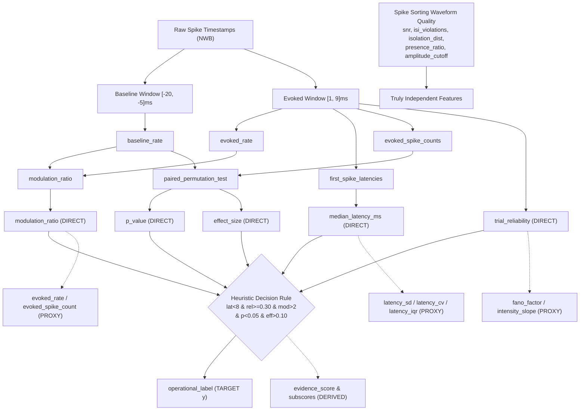

# Operational Label Construction & Dependency Graph Audit

**Project**: Computationally Reliable Optotagging of Neuropixels Neural Recordings  
**Analysis Date**: 2026-09-28  
**Dataset**: Full 28-Specimen Master Dataset (18,316 Units)  

---

## 1. Exact Operational Label Formulation

The binary target variable `operational_label` is derived from the string variable `reference_class`:
```python
operational_label = int(reference_class == "putatively directly optotagged")
```

The underlying assignment rule in `src/labeling.py` (`assign_reference_label`) evaluates the following boolean conditions:

```python
# Insufficient data check
if n_trials < 10 or (baseline_rate == 0.0 and evoked_rate == 0.0):
    return "insufficient evidence", 0.0

# Artifact gating override
if artifact_flag:
    return "light-responsive / indirect or uncertain", 0.30

# Statistical significance check
is_significant = (p_value < 0.05) and (effect_size > 0.10)

# Operational direct criteria
passes_latency = (not isnan(median_latency_ms)) and (median_latency_ms < 8.0)
passes_reliability = (trial_reliability >= 0.30)
passes_modulation = (modulation_ratio > 2.0)

if passes_latency and passes_reliability and passes_modulation and is_significant:
    return "putatively directly optotagged", confidence
elif not is_significant or modulation_ratio <= 1.0 or trial_reliability < 0.05:
    return "not light responsive", confidence
else:
    return "light-responsive / indirect or uncertain", confidence
```

---

## 2. Formal Classification of Dataset Features

The audit partitions all 67 columns into three distinct tiers:

### Tier 1: Direct Label Defining Features (5 features)
Variables that explicitly and directly appear in the boolean rule defining `operational_label`:
1. `median_latency_ms`: Required $< 8.0\text{ ms}$
2. `trial_reliability`: Required $\ge 0.30$
3. `modulation_ratio`: Required $> 2.0$
4. `p_value`: Required $< 0.05$
5. `effect_size`: Required $> 0.10$

*(Also gated by `artifact_flag == False` and `n_trials >= 10`).*

> **Critical Consequence**: Providing any or all of these 5 features as inputs to a machine learning classifier transforms the task from biological cell-type identification into **computational rule memorization**. A decision tree (e.g., XGBoost, Random Forest) can achieve $\text{AUROC} = 1.000$ and $\text{BA} = 1.000$ simply by learning the 5 threshold cuts.

---

### Tier 2: Derived Label Proxies & Mathematically Coupled Features
Variables not explicitly appearing in the `if` statement, but mathematically, mechanically, or statistically determined by the response spike count in the optical window:
1. `evoked_rate`: Directly determines `modulation_ratio = evoked_rate / (baseline_rate + 1.0)`.
2. `baseline_rate`: Denominator of `modulation_ratio`.
3. `evoked_spike_count`: Integer transform: $\text{round}(\text{evoked\_rate} \times 0.010 \times n\_trials)$.
4. `baseline_spike_count`: Integer transform: $\text{round}(\text{baseline\_rate} \times 0.010 \times n\_trials)$.
5. `latency_sd_ms`, `latency_iqr_ms`, `latency_cv`: Coupled to first-spike latencies; only populated when evoked spikes exist.
6. `fano_factor`: Variance/mean of evoked spike counts.
7. `intensity_slope`: Slope of evoked firing rate across optical intensities.
8. `adaptation_index`: Firing rate ratio across 10-Hz train pulses.
9. `subscore_statistical`, `subscore_reliability`, `subscore_modulation`, `subscore_latency`, `subscore_jitter`, `evidence_score`: Subscores engineered directly from the 5 defining features.
10. `distance_to_decision_boundary`, `boundary_proximity`, `evidence_regime`: Direct geometrical transforms of the heuristic boundary.
11. `duplicate aliases`: `median_latency`, `responsive_trial_fraction`, `baseline_firing_rate`, `evoked_firing_rate`, `latency_variability`, `uncertainty_score`.

---

### Tier 3: Potentially Independent Features (Non-Stimulus / Pre-Stimulus)
Variables containing electrophysiological information that does **NOT** use any spike counts or timestamps from the post-stimulus optical response window $[0, 10]\text{ ms}$:
1. Waveform & Isolation Quality:
   - `snr`
   - `isi_violations`
   - `isolation_distance`
   - `presence_ratio`
   - `amplitude_cutoff`
   - `d_prime`
   - `nn_hit_rate`
   - `nn_miss_rate`
2. Pre-Stimulus Baseline Spontaneous Activity:
   - `baseline_rate` (spontaneous firing rate when decoupled from evoked responses)
   - `sham_reliability` (spontaneous false-alarm rate in matched pre-stimulus window)
3. Anatomical & Physical Metadata:
   - `anterior_posterior_ccf_coordinate`
   - `dorsal_ventral_ccf_coordinate`
   - `left_right_ccf_coordinate`
   - `probe_horizontal_position`
   - `probe_vertical_position`

---

## 3. Label Dependency Graph (Mermaid)


